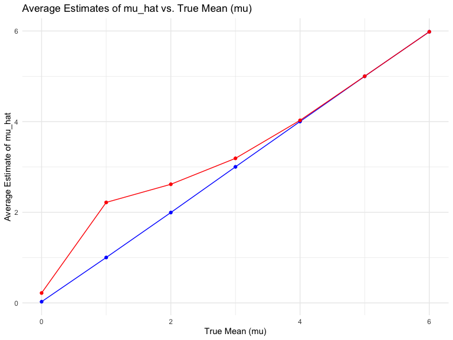

p8105_hw5_xz3173
================
Xue Zhang
2023-11-02

# Problem 1

``` r
# Load homicide dataset
homicide_df = 
  read_csv("data/homicide-data.csv") 
```

    ## Rows: 52179 Columns: 12
    ## ── Column specification ────────────────────────────────────────────────────────
    ## Delimiter: ","
    ## chr (9): uid, victim_last, victim_first, victim_race, victim_age, victim_sex...
    ## dbl (3): reported_date, lat, lon
    ## 
    ## ℹ Use `spec()` to retrieve the full column specification for this data.
    ## ℹ Specify the column types or set `show_col_types = FALSE` to quiet this message.

``` r
# Explore data
str(homicide_df)
```

    ## spc_tbl_ [52,179 × 12] (S3: spec_tbl_df/tbl_df/tbl/data.frame)
    ##  $ uid          : chr [1:52179] "Alb-000001" "Alb-000002" "Alb-000003" "Alb-000004" ...
    ##  $ reported_date: num [1:52179] 20100504 20100216 20100601 20100101 20100102 ...
    ##  $ victim_last  : chr [1:52179] "GARCIA" "MONTOYA" "SATTERFIELD" "MENDIOLA" ...
    ##  $ victim_first : chr [1:52179] "JUAN" "CAMERON" "VIVIANA" "CARLOS" ...
    ##  $ victim_race  : chr [1:52179] "Hispanic" "Hispanic" "White" "Hispanic" ...
    ##  $ victim_age   : chr [1:52179] "78" "17" "15" "32" ...
    ##  $ victim_sex   : chr [1:52179] "Male" "Male" "Female" "Male" ...
    ##  $ city         : chr [1:52179] "Albuquerque" "Albuquerque" "Albuquerque" "Albuquerque" ...
    ##  $ state        : chr [1:52179] "NM" "NM" "NM" "NM" ...
    ##  $ lat          : num [1:52179] 35.1 35.1 35.1 35.1 35.1 ...
    ##  $ lon          : num [1:52179] -107 -107 -107 -107 -107 ...
    ##  $ disposition  : chr [1:52179] "Closed without arrest" "Closed by arrest" "Closed without arrest" "Closed by arrest" ...
    ##  - attr(*, "spec")=
    ##   .. cols(
    ##   ..   uid = col_character(),
    ##   ..   reported_date = col_double(),
    ##   ..   victim_last = col_character(),
    ##   ..   victim_first = col_character(),
    ##   ..   victim_race = col_character(),
    ##   ..   victim_age = col_character(),
    ##   ..   victim_sex = col_character(),
    ##   ..   city = col_character(),
    ##   ..   state = col_character(),
    ##   ..   lat = col_double(),
    ##   ..   lon = col_double(),
    ##   ..   disposition = col_character()
    ##   .. )
    ##  - attr(*, "problems")=<externalptr>

``` r
summary(homicide_df)
```

    ##      uid            reported_date       victim_last        victim_first      
    ##  Length:52179       Min.   : 20070101   Length:52179       Length:52179      
    ##  Class :character   1st Qu.: 20100318   Class :character   Class :character  
    ##  Mode  :character   Median : 20121216   Mode  :character   Mode  :character  
    ##                     Mean   : 20130899                                        
    ##                     3rd Qu.: 20150911                                        
    ##                     Max.   :201511105                                        
    ##                                                                              
    ##  victim_race         victim_age         victim_sex            city          
    ##  Length:52179       Length:52179       Length:52179       Length:52179      
    ##  Class :character   Class :character   Class :character   Class :character  
    ##  Mode  :character   Mode  :character   Mode  :character   Mode  :character  
    ##                                                                             
    ##                                                                             
    ##                                                                             
    ##                                                                             
    ##     state                lat             lon          disposition       
    ##  Length:52179       Min.   :25.73   Min.   :-122.51   Length:52179      
    ##  Class :character   1st Qu.:33.77   1st Qu.: -96.00   Class :character  
    ##  Mode  :character   Median :38.52   Median : -87.71   Mode  :character  
    ##                     Mean   :37.03   Mean   : -91.47                     
    ##                     3rd Qu.:40.03   3rd Qu.: -81.76                     
    ##                     Max.   :45.05   Max.   : -71.01                     
    ##                     NA's   :60      NA's   :60

**Describe the raw data.**

**The `homicide_df` dataset contains 52179 rows and 12 columns, with
each row representing a single homicide case report from the data that
the Washington Post has collected in 50 large U.S. cities. There are
several victim-related variables, such as first name, last name, race,
age, sex of victims. There are also homicide-related variables, such as
the location of the killing, whether an arrest was made.**

``` r
# Create a city_state variable
city_summary = homicide_df |>
  mutate(city_state = str_c(city, state, sep = ", ")) |>

# Summarize within cities to obtain the total number of homicides and the number of unsolved homicides (those for which the disposition is “Closed without arrest” or “Open/No arrest”)
  group_by(city_state) |>
  summarize(
    total_homicides = n(),
    unsolved_homicides = sum(disposition %in% c("Closed without arrest", "Open/No arrest"))
  )
```

For the city of Baltimore, MD, use the prop.test function to estimate
the proportion of homicides that are unsolved; save the output of
prop.test as an R object, apply the broom::tidy to this object and pull
the estimated proportion and confidence intervals from the resulting
tidy dataframe.

``` r
# Filter data for Baltimore, MD
baltimore_df = city_summary |>
  filter(city_state == "Baltimore, MD") 

# Using prop.test to estimate the proportion of unsolved homicides
prop_test_result = 
  prop.test(
    x = pull(baltimore_df, unsolved_homicides),
    n = pull(baltimore_df, total_homicides)) 

# Tidying the result using broom:tidy
tidied_result = broom::tidy(prop_test_result)

# Extracting the estimated proportion and confidence intervals
estimated_proportion = pull(tidied_result, estimate)
conf_low = pull(tidied_result, conf.low)
conf_high = pull(tidied_result, conf.high)
```

Now run prop.test for each of the cities in your dataset, and extract
both the proportion of unsolved homicides and the confidence interval
for each. Do this within a “tidy” pipeline, making use of purrr::map,
purrr::map2, list columns and unnest as necessary to create a tidy
dataframe with estimated proportions and CIs for each city.

``` r
# Run prop.test for each city and create a tidy dataframe
results_df = city_summary |>
  mutate(
    prop_test_result = map2(
      unsolved_homicides,
      total_homicides,
      ~prop.test(x = .x, n = .y)
    )
  ) |>
  mutate(tidied_result = map(prop_test_result, broom::tidy)) |>
  unnest(tidied_result) |>
  select(city_state, estimate, conf.low, conf.high)
```

Create a plot that shows the estimates and CIs for each city – check out
geom_errorbar for a way to add error bars based on the upper and lower
limits. Organize cities according to the proportion of unsolved
homicides.

``` r
# Create the plot
plot = 
  ggplot(
    results_df, 
    aes(
      x = reorder(city_state, -estimate), 
      y = estimate)) +
  geom_point(color = "blue", size = 3) +
  geom_errorbar(
    aes(
      ymin = conf.low,
      ymax = conf.high), 
    width = 0.2,
    color = "red") +
  coord_flip() +
  labs(
    title = "Proportiton of Unsolved Homicides by City",
    x = "City",
    y = "Estimated Proportion of Unsolved Homicides") 

plot
```


# Problem 2

Create a tidy dataframe containing data from all participants, including
the subject ID, arm, and observations over time:

``` r
# Start with a dataframe containing all file names; the list.files function will help
file_names = list.files(path = "data2", pattern = "*.csv", full.names = TRUE)
file_info = tibble(file = file_names)
```

``` r
# Iterate over file names and read in data for each subject using purrr::map and saving the result as a new variable in the dataframe
file_info = file_info |>
  mutate(data = map(file, read_csv))
```

    ## Rows: 1 Columns: 8
    ## ── Column specification ────────────────────────────────────────────────────────
    ## Delimiter: ","
    ## dbl (8): week_1, week_2, week_3, week_4, week_5, week_6, week_7, week_8
    ## 
    ## ℹ Use `spec()` to retrieve the full column specification for this data.
    ## ℹ Specify the column types or set `show_col_types = FALSE` to quiet this message.
    ## Rows: 1 Columns: 8
    ## ── Column specification ────────────────────────────────────────────────────────
    ## Delimiter: ","
    ## dbl (8): week_1, week_2, week_3, week_4, week_5, week_6, week_7, week_8
    ## 
    ## ℹ Use `spec()` to retrieve the full column specification for this data.
    ## ℹ Specify the column types or set `show_col_types = FALSE` to quiet this message.
    ## Rows: 1 Columns: 8
    ## ── Column specification ────────────────────────────────────────────────────────
    ## Delimiter: ","
    ## dbl (8): week_1, week_2, week_3, week_4, week_5, week_6, week_7, week_8
    ## 
    ## ℹ Use `spec()` to retrieve the full column specification for this data.
    ## ℹ Specify the column types or set `show_col_types = FALSE` to quiet this message.
    ## Rows: 1 Columns: 8
    ## ── Column specification ────────────────────────────────────────────────────────
    ## Delimiter: ","
    ## dbl (8): week_1, week_2, week_3, week_4, week_5, week_6, week_7, week_8
    ## 
    ## ℹ Use `spec()` to retrieve the full column specification for this data.
    ## ℹ Specify the column types or set `show_col_types = FALSE` to quiet this message.
    ## Rows: 1 Columns: 8
    ## ── Column specification ────────────────────────────────────────────────────────
    ## Delimiter: ","
    ## dbl (8): week_1, week_2, week_3, week_4, week_5, week_6, week_7, week_8
    ## 
    ## ℹ Use `spec()` to retrieve the full column specification for this data.
    ## ℹ Specify the column types or set `show_col_types = FALSE` to quiet this message.
    ## Rows: 1 Columns: 8
    ## ── Column specification ────────────────────────────────────────────────────────
    ## Delimiter: ","
    ## dbl (8): week_1, week_2, week_3, week_4, week_5, week_6, week_7, week_8
    ## 
    ## ℹ Use `spec()` to retrieve the full column specification for this data.
    ## ℹ Specify the column types or set `show_col_types = FALSE` to quiet this message.
    ## Rows: 1 Columns: 8
    ## ── Column specification ────────────────────────────────────────────────────────
    ## Delimiter: ","
    ## dbl (8): week_1, week_2, week_3, week_4, week_5, week_6, week_7, week_8
    ## 
    ## ℹ Use `spec()` to retrieve the full column specification for this data.
    ## ℹ Specify the column types or set `show_col_types = FALSE` to quiet this message.
    ## Rows: 1 Columns: 8
    ## ── Column specification ────────────────────────────────────────────────────────
    ## Delimiter: ","
    ## dbl (8): week_1, week_2, week_3, week_4, week_5, week_6, week_7, week_8
    ## 
    ## ℹ Use `spec()` to retrieve the full column specification for this data.
    ## ℹ Specify the column types or set `show_col_types = FALSE` to quiet this message.
    ## Rows: 1 Columns: 8
    ## ── Column specification ────────────────────────────────────────────────────────
    ## Delimiter: ","
    ## dbl (8): week_1, week_2, week_3, week_4, week_5, week_6, week_7, week_8
    ## 
    ## ℹ Use `spec()` to retrieve the full column specification for this data.
    ## ℹ Specify the column types or set `show_col_types = FALSE` to quiet this message.
    ## Rows: 1 Columns: 8
    ## ── Column specification ────────────────────────────────────────────────────────
    ## Delimiter: ","
    ## dbl (8): week_1, week_2, week_3, week_4, week_5, week_6, week_7, week_8
    ## 
    ## ℹ Use `spec()` to retrieve the full column specification for this data.
    ## ℹ Specify the column types or set `show_col_types = FALSE` to quiet this message.
    ## Rows: 1 Columns: 8
    ## ── Column specification ────────────────────────────────────────────────────────
    ## Delimiter: ","
    ## dbl (8): week_1, week_2, week_3, week_4, week_5, week_6, week_7, week_8
    ## 
    ## ℹ Use `spec()` to retrieve the full column specification for this data.
    ## ℹ Specify the column types or set `show_col_types = FALSE` to quiet this message.
    ## Rows: 1 Columns: 8
    ## ── Column specification ────────────────────────────────────────────────────────
    ## Delimiter: ","
    ## dbl (8): week_1, week_2, week_3, week_4, week_5, week_6, week_7, week_8
    ## 
    ## ℹ Use `spec()` to retrieve the full column specification for this data.
    ## ℹ Specify the column types or set `show_col_types = FALSE` to quiet this message.
    ## Rows: 1 Columns: 8
    ## ── Column specification ────────────────────────────────────────────────────────
    ## Delimiter: ","
    ## dbl (8): week_1, week_2, week_3, week_4, week_5, week_6, week_7, week_8
    ## 
    ## ℹ Use `spec()` to retrieve the full column specification for this data.
    ## ℹ Specify the column types or set `show_col_types = FALSE` to quiet this message.
    ## Rows: 1 Columns: 8
    ## ── Column specification ────────────────────────────────────────────────────────
    ## Delimiter: ","
    ## dbl (8): week_1, week_2, week_3, week_4, week_5, week_6, week_7, week_8
    ## 
    ## ℹ Use `spec()` to retrieve the full column specification for this data.
    ## ℹ Specify the column types or set `show_col_types = FALSE` to quiet this message.
    ## Rows: 1 Columns: 8
    ## ── Column specification ────────────────────────────────────────────────────────
    ## Delimiter: ","
    ## dbl (8): week_1, week_2, week_3, week_4, week_5, week_6, week_7, week_8
    ## 
    ## ℹ Use `spec()` to retrieve the full column specification for this data.
    ## ℹ Specify the column types or set `show_col_types = FALSE` to quiet this message.
    ## Rows: 1 Columns: 8
    ## ── Column specification ────────────────────────────────────────────────────────
    ## Delimiter: ","
    ## dbl (8): week_1, week_2, week_3, week_4, week_5, week_6, week_7, week_8
    ## 
    ## ℹ Use `spec()` to retrieve the full column specification for this data.
    ## ℹ Specify the column types or set `show_col_types = FALSE` to quiet this message.
    ## Rows: 1 Columns: 8
    ## ── Column specification ────────────────────────────────────────────────────────
    ## Delimiter: ","
    ## dbl (8): week_1, week_2, week_3, week_4, week_5, week_6, week_7, week_8
    ## 
    ## ℹ Use `spec()` to retrieve the full column specification for this data.
    ## ℹ Specify the column types or set `show_col_types = FALSE` to quiet this message.
    ## Rows: 1 Columns: 8
    ## ── Column specification ────────────────────────────────────────────────────────
    ## Delimiter: ","
    ## dbl (8): week_1, week_2, week_3, week_4, week_5, week_6, week_7, week_8
    ## 
    ## ℹ Use `spec()` to retrieve the full column specification for this data.
    ## ℹ Specify the column types or set `show_col_types = FALSE` to quiet this message.
    ## Rows: 1 Columns: 8
    ## ── Column specification ────────────────────────────────────────────────────────
    ## Delimiter: ","
    ## dbl (8): week_1, week_2, week_3, week_4, week_5, week_6, week_7, week_8
    ## 
    ## ℹ Use `spec()` to retrieve the full column specification for this data.
    ## ℹ Specify the column types or set `show_col_types = FALSE` to quiet this message.
    ## Rows: 1 Columns: 8
    ## ── Column specification ────────────────────────────────────────────────────────
    ## Delimiter: ","
    ## dbl (8): week_1, week_2, week_3, week_4, week_5, week_6, week_7, week_8
    ## 
    ## ℹ Use `spec()` to retrieve the full column specification for this data.
    ## ℹ Specify the column types or set `show_col_types = FALSE` to quiet this message.

``` r
# Tidy the result; manipulate file names to include control arm and subject ID, make sure weekly observations are “tidy”, and do any other tidying that’s necessary
tidy_data = file_info |>
  mutate(
    subject_id = as.numeric(str_extract(file, "(?<=con_|exp_)[0-9]+")), 
    arm = ifelse(str_detect(file, "con"), "con", "exp")) |>
  select(subject_id, arm, data) |>
  unnest(cols = c(data)) |>
  pivot_longer(
    cols = starts_with("week"),
    names_to = "week",
    values_to = "observation") |>
  mutate(
    week = str_extract(week, "[0-9]+") |>
      as.numeric()) 
```

``` r
# Make a spaghetti plot showing observations on each subject over time, and comment on differences between groups.
ggplot(
  tidy_data, 
  aes(
    x = week,
    y = observation,
    group = interaction(subject_id, arm),
    color = arm)) +
  geom_line() +
  geom_point() +
  facet_grid(~ arm) +
  labs(title = "Spaghetti Plot of Observations over Time",
       x = "Week",
       y = "Observation") 
```


**Make a spaghetti plot showing observations on each subject over time,
and comment on differences between groups.**

**Upon examining the spaghetti plot, we observe distinct patterns
between the control and experimental groups. Subjects in the control
group (`con`) exhibit relatively stable observation values over the
weeks, with minor fluctuations around a consistent mean. The mean
`mean(tidy_data$observation[tidy_data$arm == "con"])` and median
`median(tidy_data$observation[tidy_data$arm == "con"])` are close, and
the range of observations is
`range(tidy_data$observation[tidy_data$arm == "con"])`, this suggests a
lack of significant change or impact over time within the control
group.**

**In contrast, subjects in the experimental group (`exp`) display a more
pronounced trend. There’s a noticeable upward trajectory in the
observation values, where the range of observations is
`range(tidy_data$observation[tidy_data$arm == "exp"])` indicating a
potential effect of the experimental condition being tested.**

**Furthermore, it seems that there is more variability in the
experimental group than in the control group. Although the majority of
subjects in the experimental arm exhibit an overall rising trend, a
small number of outliers deviate from this pattern, suggesting that each
subject’s response to the experimental condition is unique.**

**Overall, the spaghetti plot suggests that, in contrast to the steady
patterns seen in the control group, the experimental condition can have
a major effect on the observation variable. However, a closer
examination of each individual response mechanism is necessary due to
the existence of outliers and variability within the experimental
group.**

**Given the range of observations and the the presence of both positive
and negative values, it could be helpful to investigate further why some
subjects in the control group had negative observation values and
whether this is usual or an indicator of measurement error or other
factors.**

# Problem 3

When designing an experiment or analysis, a common question is whether
it is likely that a true effect will be detected – put differently,
whether a false null hypothesis will be rejected. The probability that a
false null hypothesis is rejected is referred to as power, and it
depends on several factors, including: the sample size; the effect size;
and the error variance. In this problem, you will conduct a simulation
to explore power in a one-sample t-test.

First set the following design elements:

Fix n=30 Fix σ=5 Set μ=0 . Generate 5000 datasets from the model

x∼Normal\[μ,σ\]

For each dataset, save μ̂ and the p-value arising from a test of H:μ=0
using α=0.05 . Hint: to obtain the estimate and p-value, use broom::tidy
to clean the output of t.test.

Repeat the above for μ={1,2,3,4,5,6} , and complete the following:

``` r
# Define the simulation function
sim_t_test = function(n = 30, mu = 0, sigma =5) {
    x = rnorm(n, mean = mu, sd = sigma)
    test_result = t.test(x, mu = 0)
    broom::tidy(test_result)
}
```

``` r
mu_values = 0:6
alpha = 0.05

# Create a grid for simulations
sim_grid =
  expand_grid(
    mu = mu_values,
    iter = 1:5000
    ) 
```

``` r
# Perform simulations
all_results = sim_grid |>
  mutate(
    sim_results = 
      map2(
        mu,
        iter,
        ~sim_t_test(
          n = 30,
          mu = .x, 
          sigma = 5))) |>
  select(-iter) |>
  unnest(sim_results) |>
  mutate(
    rejected_null = p.value < alpha,
    mu = as.numeric(mu)
  )
```

Make a plot showing the proportion of times the null was rejected (the
power of the test) on the y axis and the true value of μ on the x axis.

``` r
# Calculate power for each mu
power_analysis = all_results |>
  group_by(mu) |>
  summarize(power = mean(rejected_null))

power_analysis
```

    ## # A tibble: 7 × 2
    ##      mu power
    ##   <dbl> <dbl>
    ## 1     0 0.052
    ## 2     1 0.190
    ## 3     2 0.557
    ## 4     3 0.888
    ## 5     4 0.989
    ## 6     5 1.00 
    ## 7     6 1

``` r
ggplot(power_analysis, aes(x = mu, y = power)) +
  geom_line() +
  geom_point() +
  theme_minimal() +
  labs(
    title = "Power of the Test vs. True mean (mu)",
    x = "True Mean (mu)",
    y = "Power of the Test"
  )
```


**Describe the association between effect size and power.**

**In the generated plot, we observe a clear positive association between
the effect size (true mean, mu) and the power of the test. As the value
of mu increases, moving away from the null hypothesis of mu = 0, the
power of the test also increases. This trend illustrates a fundamental
principle of hypothesis testing: larger effect sizes generally make it
easier for a test to detect significant differences from the null
hypothesis.**

**At lower values of mu (closer to 0), the power of the test is
relatively low. This indicates that when the true mean is close to the
value under the null hypothesis, our test has a reduced ability to
correctly reject the null hypothesis. In particular terms, this means
there’s a higher chance of committing a Type II error (failing to detect
a true effect) when the effect size is small.**

**As mu increases, the power of the test rises sharply. This increase in
power suggests that our test becomes more effective at detecting true
effects as they become more pronounced. When the effect size is large
(mu significantly greater than 0), the likelihood that our test will
correctly reject the null hypothesis is higher. Thus, the test
demonstrates greater sensitivity to larger effect sizes.**

**This relationship underscores the importance of considering effect
size in experimental design and analysis. In scenarios where small
effect sizes are expected, larger sample sizes might be necessary to
achieve adequate power. Conversely, for large effect sizes, even a
smaller sample might suffice to yield reliable results. The plot
demonstrates that the ability of a statistical test to uncover true
effects is heavily dependent on the magnitude of these effects relative
to the null hypothesis.**

Make a plot showing the average estimate of μ̂ on the y axis and the true
value of μ on the x axis. Make a second plot (or overlay on the first)
the average estimate of μ̂ only in samples for which the null was
rejected on the y axis and the true value of μ on the x axis.

``` r
# Calculate average estimates
average_estimates = all_results |>
  group_by(mu) |>
  summarize(
    overall_mean_mu_hat = mean(estimate),
    mean_mu_hat_when_rejected = mean(estimate[rejected_null], na.rm = TRUE)
  )

average_estimates
```

    ## # A tibble: 7 × 3
    ##      mu overall_mean_mu_hat mean_mu_hat_when_rejected
    ##   <dbl>               <dbl>                     <dbl>
    ## 1     0              0.0267                     0.219
    ## 2     1              1.00                       2.22 
    ## 3     2              1.99                       2.62 
    ## 4     3              3.00                       3.19 
    ## 5     4              4.00                       4.03 
    ## 6     5              5.00                       5.00 
    ## 7     6              5.98                       5.98

**Overall mean mu_hat: For each true mean value, from 0 to 6, the
overall estimate of mu_hat is very close to the true mean. This
indicates that, on average, the tests provide unbiased estimates of the
true mean.**

**Mean mu when null rejected: For mu = 0, any rejection of the null
hypothesis is actually a Type I error, as the null hypothesis is true in
this case. Thus, the mean estimate of mu_hat being 0.220 when the null
is rejected reflects the instances of these Type I errors rather than a
bias in the estimate itself. As mu increases and moves away from the
null hypothesis, the mean estimate of mu_hat in cases where the null is
rejected becomes more aligned with the true mean. This alignment is more
pronounced for higher values of mu, such as 5.99 for mu = 6, indicating
that the test is effectively capturing the ttrue effect as it becomes
larger.**

``` r
ggplot(average_estimates, aes(x = mu)) +
  geom_line(aes(y = overall_mean_mu_hat), color = "blue") +
  geom_line(aes(y = mean_mu_hat_when_rejected), color = "red") +
  geom_point(aes(y = overall_mean_mu_hat), color = "blue") +
  geom_point(aes(y = mean_mu_hat_when_rejected), color = "red") +
  theme_minimal() +
  labs(
    title = "Average Estimates of mu_hat vs. True Mean (mu)",
    x = "True Mean (mu)",
    y = "Average Estimate of mu_hat")
```



**Is the sample average of μ̂ across tests for which the null is rejected
approximately equal to the true value of μ ? Why or why not?**

**For smaller values of mu (like 0 and 1), the sample average of mu_hat
across tests for which the null hypothesis is rejected is not
approximately equal to the true value of mu. When the true effect size
is small, samples that significantly deviate from the null hypothesis
are more likely to be the result of random chance, which might cause the
effect size to be overestimated.**

**For larger values of mu (4, 5, 6), the sample average of mu_hat across
tests for which the null hypothesis is rejected closely approximates the
true value of mu. This is because, as the true effect size increases,
the likelihood of random variation leading to a rejection of the null
hypothesis decreases. The samples that result in a rejection are more
likely to be genuinely reflecting the true effect size, leading to more
accurate estimates.**

**Conclusion: The data shows that the bias in estimates of mu_hat when
considering only samples where the null hypothesis is rejected depends
on the true effect size. For small effect sizes, this bias is
significant, which can cause overestimation. For large effect sizes, the
bias decreases, and the estimations become significantly more accurate.
This understanding is essential for evaluating statistical tests
findings, especially in cases where significant results are
preferentially reported or considered.**
